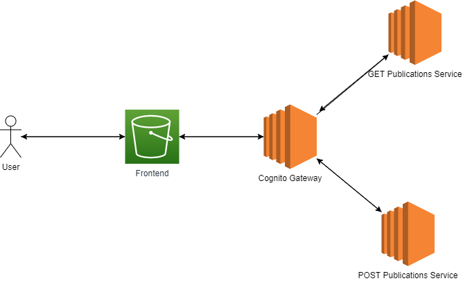
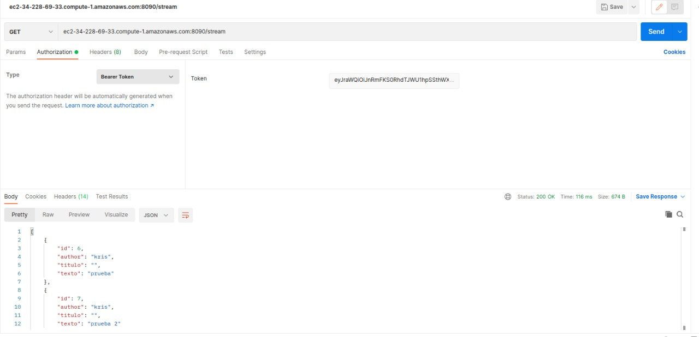
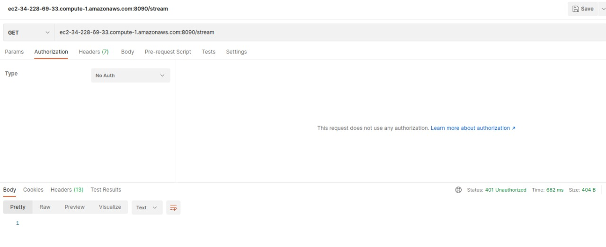
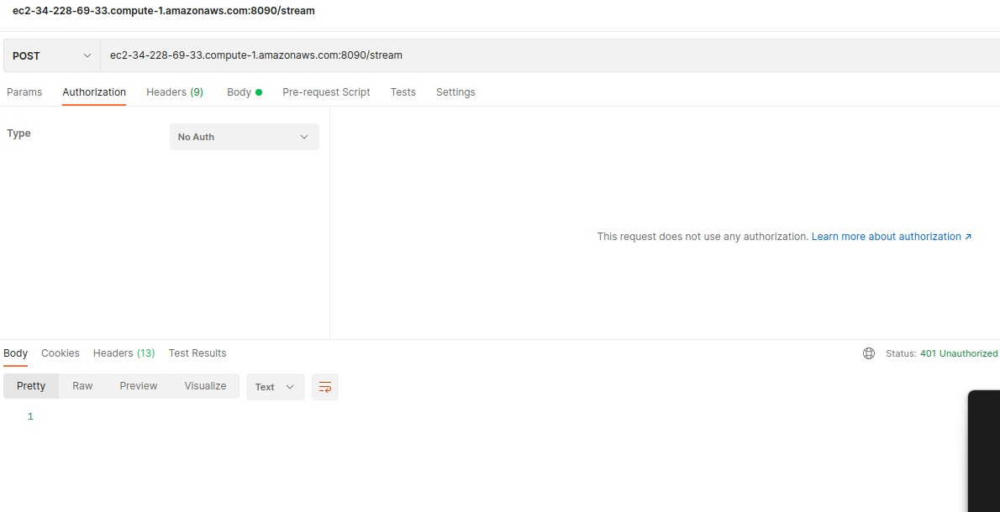
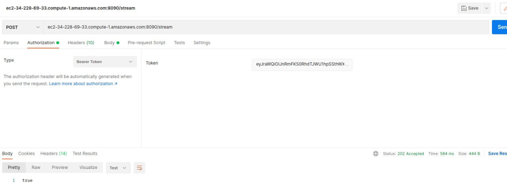

# Twitter Clone 

Este proyecto tiene como finalidad ofrecer un servicio similar a Twitter en el que los usuarios podrán iniciar sesión y realizar publicaciones en el hilo principal dividido en microservicios que fueron desplegados en AWS; estando los servicios Cognito Gateway, GET y POST Service en EC2 y el Frontend en S3.

## Enlaces a los otros servicios

* https://github.com/MariaJoseTorresN/MSAREP.git //Get Service
* https://github.com/MariaJoseTorresN/MicroserviciosAREP //Post Service
* https://github.com/SebastianOspina24/cognitogetway //CognitoGateway

El get service y post service se manejaron en springboot utilizando JPA, el primero se encarga de traer todas las publicaciones hechas mientras que el segundo permite publicar cada *tweet* con su respectivo **autor** y **título**. Con el gateway se redirigen las peticiones a los microservicios. En los tres repositorios se manejo springboot ya que ofrece jwt que necesitamos para implementar cognito.

## Diagrama de la solución

## Video del funcionamiento

## Reporte de pruebas

Tenemos el reporte de pruebas el cual hacemos pruebas a nuestro getway para verificar que la seguridad por medio del jwt de cognito este funcionando perfecta mente, primero vamos a hacer uso del get y el post a la direccion /stream que es donde tenemos nuesto api publicado, haciendo uso de postman podemos evidenciar el funcionamiento correcto del mismo

Como se puede apreciar en las imagenes los dos request nos dan un error de autrizacion por que al notener el jwt este nos va a dar un error y no nos permite el ingreso al api

Y en la consola vamos a poder ver este error

Esto es por que no se puede hacer una verificacion adecuada

Ahora vamos a ejecutar el codigo pero esta ves con un jwt valido que obtenemos desde el cognito de aws

Como podemos apreciar es de forma exitosa lo que nos da un resultado true en la creacion y un arreglo de json en el post